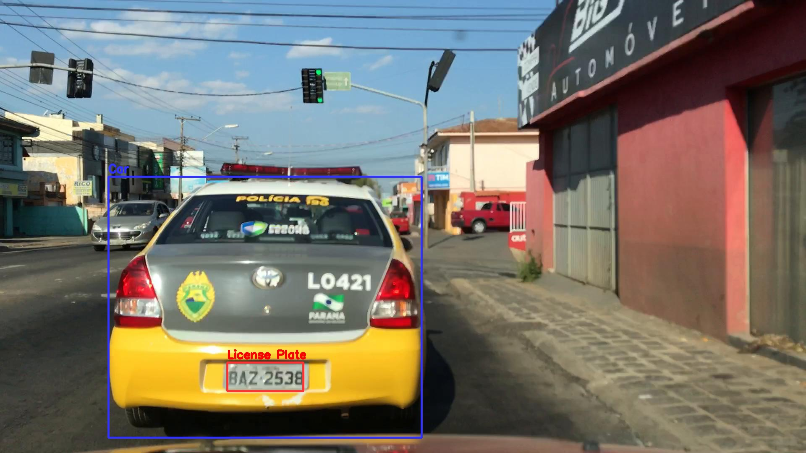

# SSD-Model-trained-for-Car-and-License-plate-Detection
SSD Model trained for Car and License plate Detection 

### Tested On:
    python 3.6
    opencv==3.4.0
    numpy
    tensorflow==1.14.0

Model: SSD mobilenetv2

#### Testing on images folder:
    >python testing_on_video.py images_folder

#### Testing on video:
    >python testing_on_video.py video.mp4 out.mp4
    
    
### Results:

